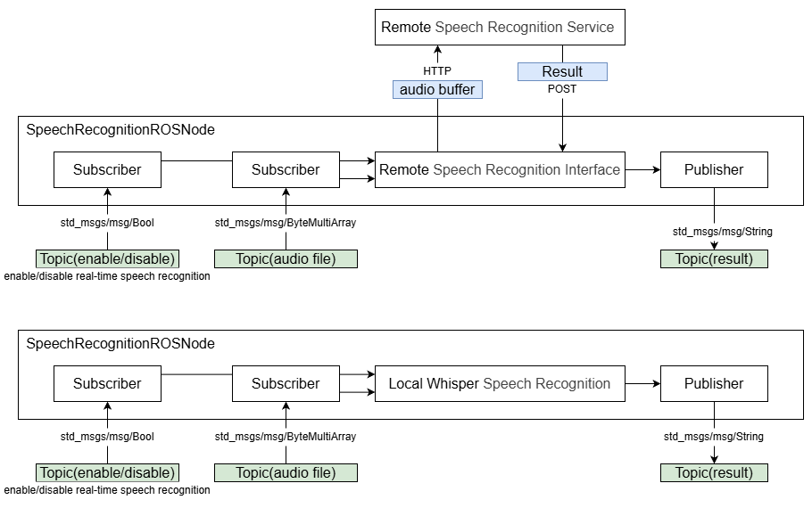

<div align="center">
  <h1>QRB ROS Speech Recognition ROS Node</h1>
  <p align="center">
   
      
  </p>
  <p>QRB ROS Speech Recognition ROS Node on Qualcomm Robotics Platforms</p>
  
  <a href="https://ubuntu.com/download/qualcomm-iot" target="_blank"></a>
  <a href="https://docs.ros.org/en/jazzy/" target="_blank"></a>
  
</div>

---

## 👋 Overview

Samples: QRB ROS Speech Recognition ROS Node provide a real-time speech recognition ROS Node for developers to directly develop applications.

This Speech Recognition ROS Node realizes real-time speech recognition of complete sentences through real-time detection of sound intensity.
This Speech Recognition ROS Node enables Collect voice through USB MIC and supports three usage scenarios:
1: local mode: Running the AI-Hub whisper tiny model in local to convert audio date into text;
2: remote mode: Run a larger whisper model in a self-built remote service to convert audio data into text;
3: In addition to USB mic, it also supports voice recognition of remote voice topic.
Developers can directly use this ROS Node to group the application pipeline.

To embrace open source and robotics developerment, we have developed the Speech Recognition ROS Node that support Speech to Text. 
The feature as follows:

- Provide ROS node include
  - support Speech to Text.
  - Subscriber /whisper_enable to enable/disable speech recognition function.
  - publisher /whisper_text to output the result of speech recognition.
  - Subscriber /audio_file to receive remote voice topic.

> [!Note] limitations:
> - Supports USB MIC.
> - Supports Whisper tiny english model in local that provide by AI-HUB.
> - Supports the remote mode, but user need to establish themselves, and we provide guidance.
> - Choice use local model or remote model via config the launch file.
> - Two launch files provide USB MIC speech recognition and audio file speech recognition.

## Usercase for Speech Recognition ROS Node


## Pipeline flow for Speech Recognition ROS Node



## ⚓ APIs

### 🔹 `Speech Recognition ROS Node` APIs

#### ROS interfaces

<table>
  <tr>
    <th>Interface</th>
    <th>Name</th>
    <th>Type</th>
    <td>Description</td>
  </tr>
  <tr>
    <td>Subscriber</td>
    <td>/whisper_enable</td>
    <td>std_msgs/msg/Bool</td>
    <td>Enable/Disable Speech Recognition</td>
  </tr>
  <tr>
    <td>Publisher</td>
    <td>/whisper_text</td>
    <td>std_msgs/msg/String</td>
    <td>Speech Recognition Result</td>
  </tr>
  <tr>
    <td>Subscriber</td>
    <td>/audio_file</td>
    <td>std_msgs/msg/ByteMultiArray</td>
    <td>Audio File</td>
  </tr>
</table>

## 🎯 Supported targets

<table >
  <tr>
    <th>Development Hardware</th>
    <td>Qualcomm Dragonwing™ RB3 Gen2</td>
    <td>Qualcomm Dragonwing™ RB5 Gen2</td>
    <td>Qualcomm Dragonwing™ IQ-9075 EVK</td>
  </tr>
  <tr>
    <th>Hardware Overview</th>
    <th><a href="https://www.qualcomm.com/developer/hardware/rb3-gen-2-development-kit"></a></th>
    <th><a href="https://www.qualcomm.com/developer/hardware/rb3-gen-2-development-kit"></a></th>
    <th><a href="https://www.qualcomm.com/products/internet-of-things/industrial-processors/iq9-series/iq-9075"></a></th>
  </tr>
  <tr>
    <th>MIPI-CSI Camera Support</th>
    <td><li>IMX577(12MP)</li><li>OV9282(1MP)</li></td>
    <td><li>IMX577(12MP)</li><li>OV9282(1MP)</li><li>IMX586(48MP)</li><li>IMX686(64MP)</li></td>
    <td><li>IMX577(12MP)</li><li>OV9282(1MP)</li></td>
  </tr>
  <tr>
    <th>GMSL Camera Support</th>
    <td>Leopard Imaging AR0231 GMSL2</td>
    <td>Leopard Imaging AR0231 GMSL2</td>
    <td><li>LI-VENUS-OX03F10-96717-120H(Bayer)</li><li>LI-VENUS-OX03F10-OAX40-GM2A-118H(YUV)</li></td>
  </tr>
</table>

---

## 👨‍💻 Build from Source and Start on UBUNTU

> **Note：**
> This document 's build & run is the latest.
> If it conflict with the online document, please follow this.


#### Setup
1. Clone this repository.

2. Prepare the environment and install dependent packages.
```
source ./qrb_ros_samples/ai_audio/sample_speech_recognition_rt_rosnode/test/install_packages_2.sh
```

3. prepare AI-HUB model.(if you choice use local whsiper model to speech recognition)
```
cd ./qrb_ros_samples/ai_audio/sample_speech_recognition_rt_rosnode
mkdir model
```

- download MEL FILTER FILE to ./qrb_ros_samples/ai_audio/sample_speech_recognition_rt_rosnode/model.
```
https://qaihub-public-assets.s3.us-west-2.amazonaws.com/qai-hub-models/models/whisper_asr_shared/v1/openai_assets/mel_filters.npz
```

- download ENCODING MODEL to ./qrb_ros_samples/ai_audio/sample_speech_recognition_rt_rosnode/model.
```
https://aihub.qualcomm.com/models/whisper_tiny_en?domain=Audio&useCase=Speech+Recognition -> WhisperEncoder -> QCS8550 -> TFLite -> whisper_tiny_en-whisperencoder.tflite
```

- download DECODING MODEL to ./qrb_ros_samples/ai_audio/sample_speech_recognition_rt_rosnode/model.
```
https://aihub.qualcomm.com/models/whisper_tiny_en?domain=Audio&useCase=Speech+Recognition -> WhisperDecoder -> QCS8550 -> TFLite -> whisper_tiny_en-whisperdecoder.tflite
```

#### Build
- Build this project.
```
cd ./qrb_ros_samples/ai_audio/sample_speech_recognition_rt_rosnode
source /opt/ros/humble/setup.bash
export WHISPER_MODEL_PATH="<path of your model>"

colcon build --cmake-clean-cache
```

#### Run Real-time speech recognition -- use qrb_ros_speech_recognition.launch.py
- This example uses a USB MIC and continuously publishes the results of speech recognition.
1. Source this file to set up the environment on your device:
```
source install/local_setup.bash
```

2. Run the ROS2 package.
```
ros2 launch qrb_ros_speech_recognition qrb_ros_speech_recognition.launch.py
```

3. Run the test Node. that will print the result of speech recognition.
```
python ./qrb_ros_samples/ai_audio/sample_speech_recognition_rt_rosnode/test/qrb_ros_print.py
```

4. Run the enable Node. 
- Publish "true" to enable Real-time speech recognition. result will continue publish.
- Publish "false" to disable Real-time speech recognition. "false" is default.
```
python ./qrb_ros_samples/ai_audio/sample_speech_recognition_rt_rosnode/test/test_asr_switch.py
```

- You can modify the qrb_ros_speech_recognition.launch.py to set the configrations.
```python
{'AudioEnergyThreshold': 0.5},  # Threshold for audio energy
{'ShortTermWindow': 0.1},       # Time window (in seconds) for sampling audio energy
{'MovingAverageWindow': 30},    # Number of samples for moving average window
{'AvailableWindow': 1},         # Minimum valid audio length (in seconds)
{'LocalTiny': 1}                # 1: run local tiny_en model; 0: use remote service
```

#### Run audio file speech recognition -- qrb_ros_android_asr.launch.py
- this example used remote speech recognition service. 
  - Make sure follow the remote speech recognition service guidance to establish the remote service.
  - Make sure that an another ros node submit /audio_file topic.

1. Source this file to set up the environment on your device:
```
source install/local_setup.bash
```

2. Run the ROS2 package.
```
ros2 launch qrb_ros_speech_recognition qrb_ros_android_asr.launch.py
```

3. Run the test Node.
```
python ./qrb_ros_samples/ai_audio/sample_speech_recognition_rt_rosnode/test/qrb_ros_print.py
```

#### Remote service guidance
This is provide a guidance to let you can establish your remote service with bigger Speech Recognition model.

1. Prepare the env for service_asr.py in to your remote service.
  
2. Establish model in your service.
- Reference https://github.com/openai/whisper
- Example ./qrb_ros_samples/ai_audio/sample_speech_recognition_rt_rosnode/test/service_asr.py:
```
model = whisper.load_model("turbo", device="cuda")
```

3. Modify IP and Port. you should make sure ROS Node use the same IP and Port
- Example service_asr.py. "10.92.128.242" is the service's IP, you can modify your port "port=5000".
```
app.run(host='10.92.128.242', port=5000)
```
- Example ROS Node qrb_ros_speech_recognition.py:
```
server_url = 'http://10.92.128.242:5000/transcribe'
```

4. Modify launch file choice remote service.
- Example qrb_ros_speech_recognition.launch.py:
```
{'LocalTiny': 0} # 1：local tiny_en. 0:remote service.
```

5. run service_asr.py in your remote service and run ROS Node in local device.

## 🤝 Contributing

We love community contributions! Get started by reading our [CONTRIBUTING.md](CONTRIBUTING.md).  
Feel free to create an issue for bug reports, feature requests, or any discussion 💡.

## ❤️ Contributors (Optional)

Thanks to all our contributors who have helped make this project better!

<table>
  <tr>
    <td align="center"><a href="https://github.com/quic-zhanlin"><br /><sub><b>quic-shouhu</b></sub></a></td>
  </tr>
</table>

## ❔ FAQs (Optional)

> 📌 Include common and popular questions and answers

## 📜 License

Project is licensed under the [BSD-3-Clause](https://spdx.org/licenses/BSD-3-Clause.html) License. See [LICENSE](./LICENSE) for the full license text.
